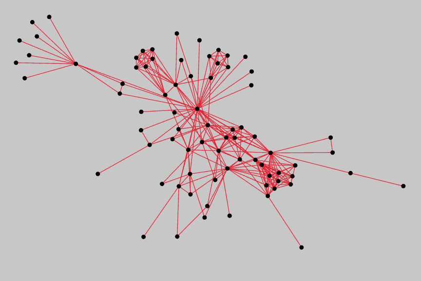
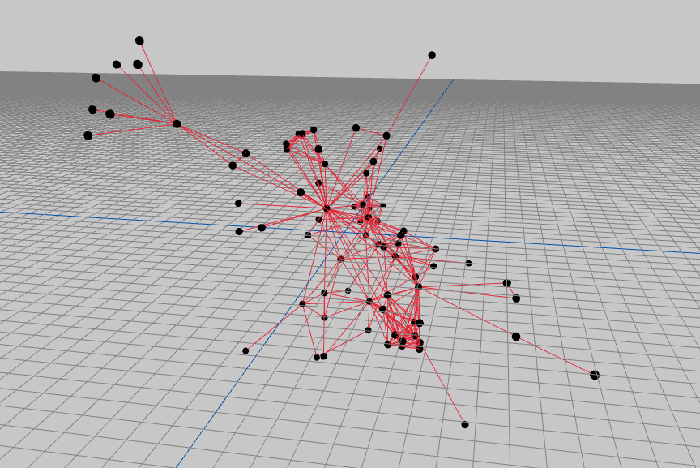

# fdg (Force Directed Graph)
A Force Directed Graph Framework for Rust.

[](https://crates.io/crates/fdg_sim)
[](https://docs.rs/fdg-sim)
[](https://github.com/skylinecc/fdg/blob/main/LICENSE)




The goal of this project is to provide a force-directed graph framework and algorithms for Rust, as well as 2D and 3D visualizers that work on the web and desktop.

[View Examples Online](https://grantshandy.github.io/fdg)

## Contents
- `/fdg-sim` The underlying force simulation framework. Handles your dataset's positions based on a physics engine of your choice (or creation).
- `/fdg-macroquad` A visualizer for `fdg-sim` that uses `macroquad` for rendering.

## Structure
```
-----------------------
|  Your Application   |
-----------------------
|    fdg-macroquad    |
-----------------------
|       fdg-sim       |
-----------------------
```

## Resources
- [Force-Directed Graphs on Wikipedia](https://en.wikipedia.org/wiki/Force-directed_graph_drawing)
- [Force Directed Drawing Algorithms (Kobourov)](https://cs.brown.edu/people/rtamassi/gdhandbook/chapters/force-directed.pdf)
- Example javascript force directed graph layout engines [d3-force](https://github.com/d3/d3-force) and [ngraph.forcelayout](https://github.com/anvaka/ngraph.forcelayout)
